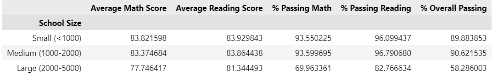
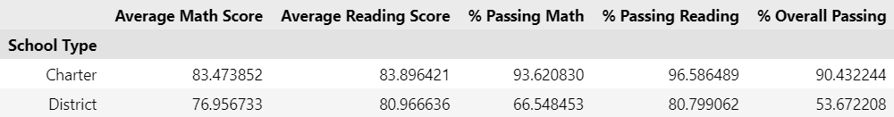
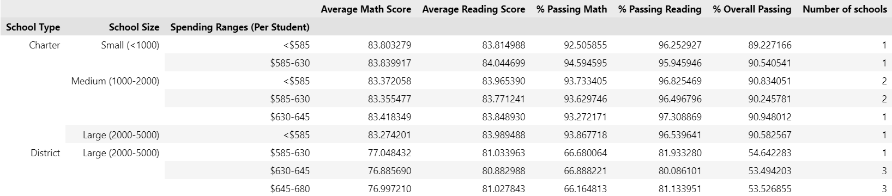

# PyCity Schools Analysis

This Jupyter Notebook contains an analysis of city's school district, including district-level and school-level summaries, performance comparisons, and additional insights.

## Overview

The analysis covers various aspects of city's school district, including district and school summaries, performance metrics, and detailed breakdowns by grade, spending, size, and school type.

## Files

- **PyCitySchools.ipynb**: The Jupyter Notebook containing the Python code and analysis.

## Data Sources

- **Resources/schools_complete.csv**: CSV file containing information about schools.
- **Resources/students_complete.csv**: CSV file containing information about students.

## Dependencies

- Pandas
- Pathlib

## Usage

1. Open the Jupyter Notebook `PyCitySchools.ipynb` in a Jupyter environment.
2. Ensure that the necessary dependencies are installed.
3. Execute the code cells sequentially to perform the analysis.
4. Review the district and school summaries, performance comparisons, and additional insights.

## Conclusions

1. Schools with **smaller** spendings per student show better performance than schools with **higher** spendings per student.

2. Schools of **small** and **medium** size show better performance than **large** schools.

3. **Chater** schools show far better performance than **district** schools.

Also I conducted more complex analysis in my own bonus part and here is a bonus conclusion:

**School type** has the most significant influence on performance. Moreover, due to this substantial factor, previous conclusions cannot be considered entirely correct. Additionally, schools are not evenly distributed among groups; for example, all **district** schools are large and have more than $585 per capita spending. Therefore, **small** and **medium** **charter** schools, with higher average performance, greatly influence on conclusions for *Scores by School Spending* and *Scores by School Size* sections.

All those conclusions can be found inline in the notebook.

# Analysis Summary
1. **Average Reading Score** and **% Passing Reading** are higher than corresponded performance metrics for math
2. **School type** has the most significant influence on performance
3. For more correct analytics and conclusion we need to consider a **few factors together** rather than concentrate on those factors standalone
4. **Number of schools** in each group also influences on conclusions, therefore, it would be better to add this metric to all tables with grouped results

