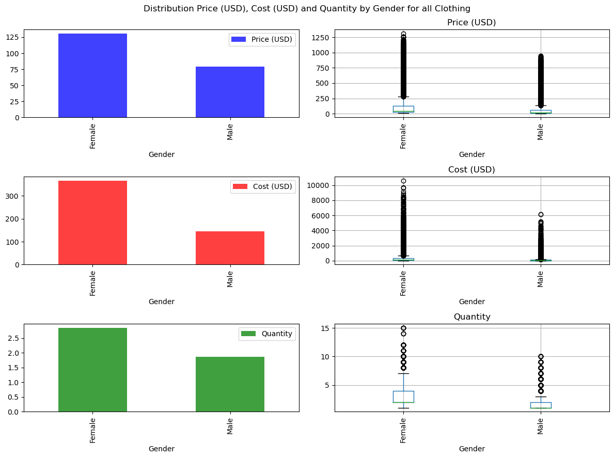
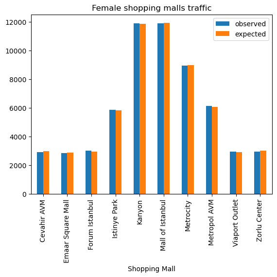
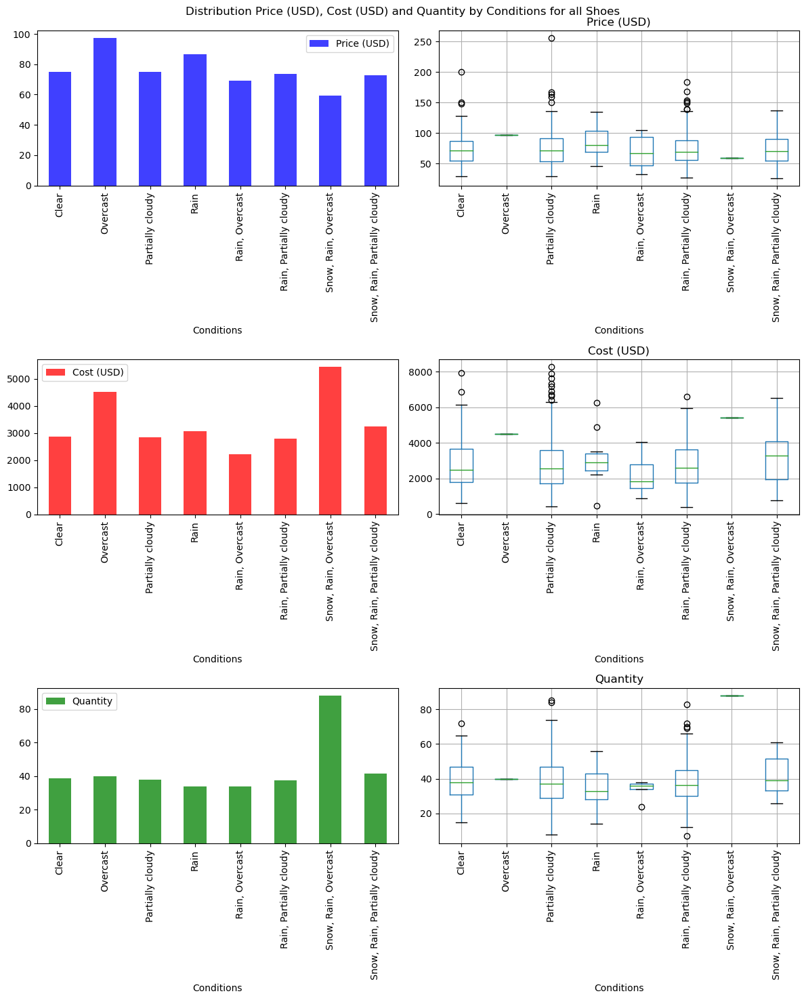
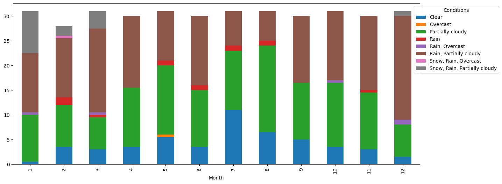
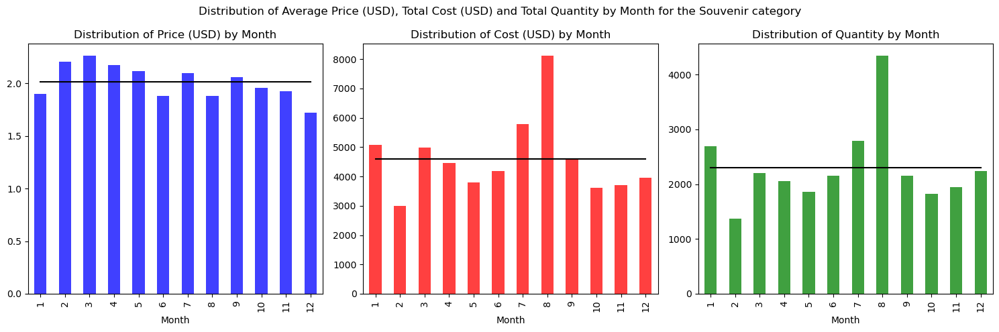
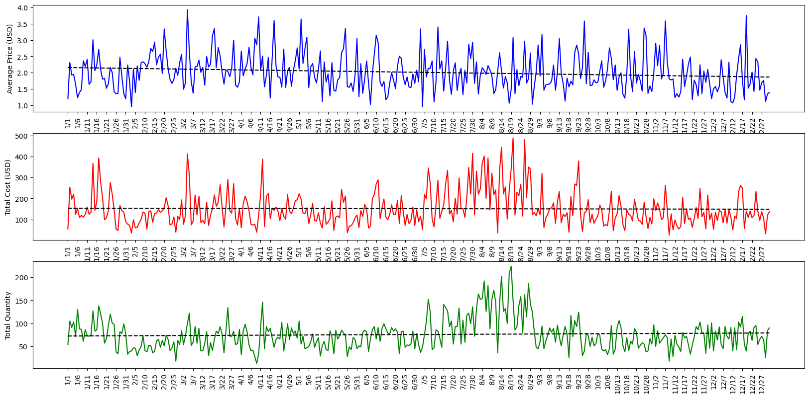

# Retail Analytics in Shopping Malls

## Project 1

## Overview

This project analyzes customer shopping data set, which represents 100k anonymized transactions in 10 shopping malls in Istanbul for the period of 1/1/2021 - 3/8/2023.
Besides this data set, historical currency exchange rates are used to account for inflation of Turkish lira. Historical weather data set is used to discover any customers' behavior related to weather conditions.

Results of the data analysis are compiled into a presentation.

### Technology Stack
**Python**: pandas, matplotlib, scipy.stats, requests

Jupyter Notebook (IronPython), REST API, CSV

### Analytical Stack
Null-hypothesis, ANOVA test, Chi-square test, linear regression

## Data Sources

- **Customer Shopping Dataset - Retail Sales Data** - https://www.kaggle.com/datasets/mehmettahiraslan/customer-shopping-dataset - Exploring Market Basket Analysis in Istanbul Retail Data. 100k records of retail sales activity in 8 shopping malls in Istanbul in 2021, 2022 and 2023
- **OpenExchangeRates API** - https://docs.openexchangerates.org - historical currency exchange rates of Turkish lira to US dollar. Used to account for inflation in Turkey in 2021, 2022 and 2023
- **Visual Crossing Weather API** - https://www.visualcrossing.com - historical weather in Istanbul in 2021, 2022 and 2023

### Source Data Files

- `Resources\source\original\customer_shopping_data.csv` - original data set from https://www.kaggle.com/datasets/mehmettahiraslan/customer-shopping-dataset
- `Resources\source\customer_shopping_data.csv` - curated data set, result of **RandomDataGeneration.ipynb**
- `Resources\output\exchange_rate.csv` - historical exchange rates, result of **CurrencyExchangeAPI.ipynb**
- `Resources\output\Istanbul_historical_weather.csv` - historical weather, result of **WeatherAPI.ipynb**
- `Resources\output\customer_shopping_data.csv` - combined and refined data set with exchange rates, weather and calendar columns

## Project Structure

The project is organized into a few IronPython notebooks:

1. **DataDiscovery.ipynb**
   This notebook represents initial analysis of the original (or curated) data set

2. **RandomDataGeneration.ipynb**
   This notebook curates the original data set in the following way:
   - Generating random prices and quantity to represent more real prices and shopping behavior
   - Random prices also reflect real inflation of Turkish lira
   - Embedding some common shopping patterns

   All prices and quantities are configured at shopping category, gender and month levels.

3. **CurrencyExchangeAPI.ipynb**
   This notebook ingests historical currency exchange rates for Turkish lira to US dollar for each unique date from the main data set

4. **WeatherAPI.ipynb**
   This notebook ingests historical weather in Istanbul for each unique date from the main data set

5. **DataPreparation.ipynb**
   This notebook transforms data from the original data set and ingested data sets in the following way:
   - Merging customer shopping dataset with historical currency exchange rates and weather
   - Calculating price and cost metrics in USD
   - Calculating age groups
   - Calculating cost groups
   - Adding calendar columns
   - Renaming and reordering columns

6. **DataAnalytics.ipynb**
   This notebook performs analysis of the transformed data:

   

   - *Common Analytics* - Analytics against the whole data set. Preferable payment methods in Lower and Upper Cost Groups. Test the hypothesis that the price/cost/quantity of products purchased in a single transaction within a certain category depends on the age of customers. Test the hypothesis that the price/cost/quantity of products purchased in a single transaction within a certain category depends on the gender of customers

   

   - *Shopping malls traffic* - Checking the hypothesis are there shopping malls that are preferable by females more than males and vice versa?
   
   
   
   - *Season Variance Analysis* - Analysis of dependency between sales activity and a month of a year. Dependency On Weather Conditions Analysis. Checking the hypothesis that purchases of shoes depend on weather conditions
   
   
   
   - *Average weather conditions over year* - Indentify weather patterns for different months
   
   
   
   - *Seasonal changes of average price and total cost for different categories* - Identifying seasonal trends in sales in different categories
   
   
   
   - *Analyzing seasonal fluctuations in the average price, total cost, and total quantity on a daily level* - Analyzing seasonal fluctuations in the Clothing, Cosmetics, Food & Beverage, Shoes, Souvenir categories

7. **Retail Analytics in Shopping Malls.pdf** - presentation about project and its analytical results

## Instructions

To run the analysis, follow these steps:

1. Clone the repository
2. Update configuration (if needed) in **RandomDataGeneration.ipynb** and regenerate source data with embedded patterns
3. (optional) Obtain API keys from https://docs.openexchangerates.org and https://www.visualcrossing.com and store them in *api_keys.py* file in the root folder under *openexchangerates_api_key* and *visualcrossing_api_key* names respectively to re-run **CurrencyExchangeAPI.ipynb** and **WeatherAPI.ipynb**. This is not required since historical data for currency exchange rates or weather is not changed
4. Run **DataPreparation.ipynb** to re-assembly the main data set for analytics
5. Run **DataAnalytics.ipynb** to explore existing analytics and discover new patterns in the shopping data

