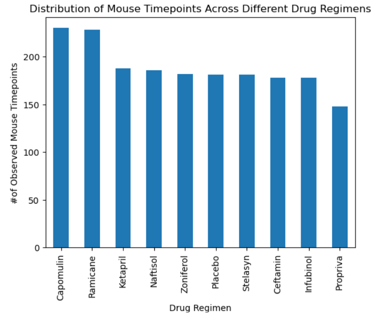
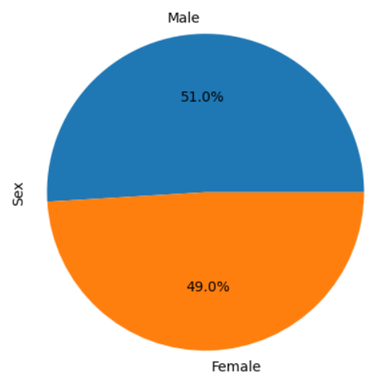
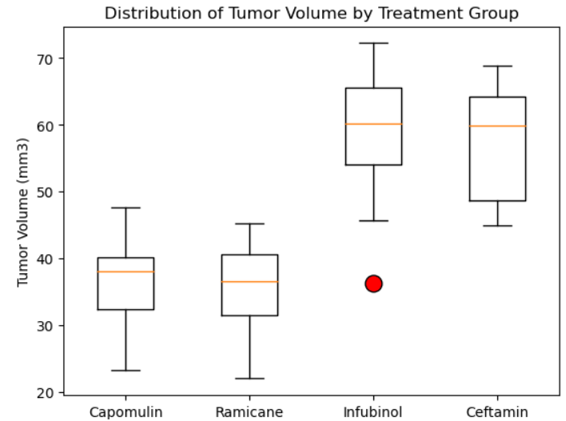
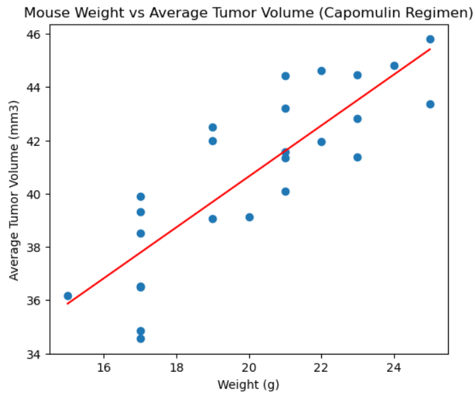

# Pymaceuticals_challenge

# Mouse Study Analysis

## Overview

This project analyzes data from a study involving mice and different drug regimens. The dataset includes information on mouse characteristics, drug regimens, and tumor volume observations. The analysis aims to derive insights into the effectiveness of various drug regimens in reducing tumor volume and understand the relationship between different variables.

## Project Structure

The project is organized into several sections:

1. **Data Cleaning and Preparation:**
   - Merging mouse metadata and study results.
   - Identifying and handling duplicate data.
   - Preparing the dataset for analysis.

2. **Summary Statistics:**
   - Calculating mean, median, variance, standard deviation, and SEM of tumor volume for each drug regimen.
   - Presenting the summary statistics in a structured table.

3. **Visualization:**
   
   

   - Generating bar plots to visualize the distribution of mouse timepoints across different drug regimens.

   

   - Creating pie charts to illustrate the sex distribution among mice.

4. **Quartiles, Outliers, and Boxplots:**

   

   - Identifying potential outliers and analyzing the distribution of tumor volume for selected drug regimens using boxplots.

5. **Correlation and Regression:**

   

   - Investigating the correlation between mouse weight and average tumor volume.
   - Performing linear regression analysis to model the relationship between weight and tumor volume.

6. **Conclusion:**
   - Summarizing key findings and insights obtained from the analysis.

## Instructions

To run the analysis, follow these steps:

1. Clone the repository:

   ```bash
   git clone https://github.com/NataliiaShevchenko620/Pymaceuticals_challenge.git
   cd Pymaceuticals_challenge
   ```
2. Run pymaceuticals_solved.ipynb Jupyter notebook


